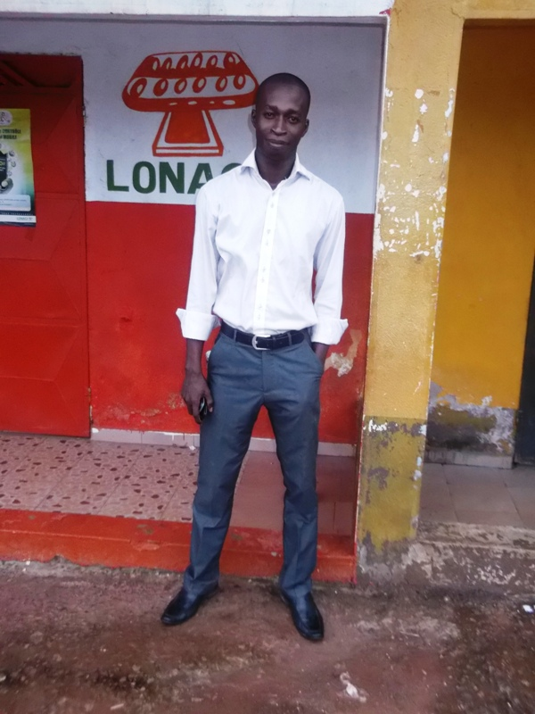
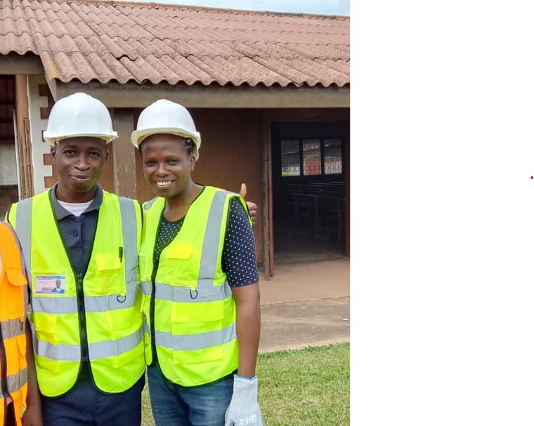
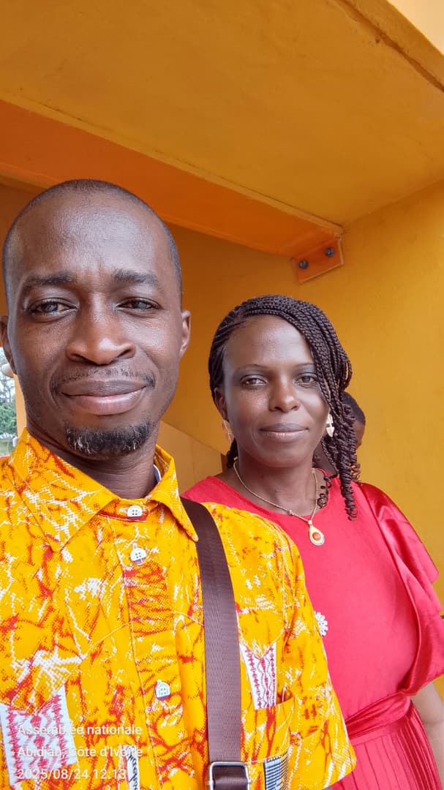

  <!-- Images -->
  

    
  

  

    
  

  

    
  

   <!-- 

    
  

  

    
  

    

    
  
 -->
  

    
  

  <!-- Boutons -->
  <a style="cursor:pointer; position:absolute; top:50%; left:0; padding:16px; color:white; font-size:24px; font-weight:bold; background:rgba(0,0,0,0.3);" onclick="plusSlides(-1)">&#10094;</a>
  <a style="cursor:pointer; position:absolute; top:50%; right:0; padding:16px; color:white; font-size:24px; font-weight:bold; background:rgba(0,0,0,0.3);" onclick="plusSlides(1)">&#10095;</a>

  <!-- Indicateurs -->
  

    
    
    
  

# 👋 Bienvenue sur mon Portfolio

  
  
  

---

## 🌍 Qui suis-je ?  
Je m’appelle **SIALOU Koffi Rodrigue**, passionné par la **transformation numérique** et l’**alphabétisation digitale en Côte d’Ivoire**.  
Je combine mon expertise technique (**DevOps, développement web, automatisation no-code, cybersécurité**) et mon engagement social (**alphabétisation numérique, formation, entrepreneuriat associatif**) pour bâtir des solutions utiles aux organisations et aux communautés.  

📌 **Missions** :  
- Promouvoir l’inclusion numérique à travers la formation et l’accompagnement.  
- Concevoir des applications web et mobiles accessibles.  
- Contribuer au développement de projets associatifs et communautaires.  

---

## 🚀 Mes projets phares
- 🔹 [*Réseau Ivoirien des Alphabétiseurs Numériques (RIAN)*](https://huggingface.co/spaces/swservices/rian)  
- 🔹 *Gestion de stock Excel & App Inventor*  
- 🔹 *Application Web – Programmation des volontaires*  
- 🔹 *Protocole d’observation passive du dark web (Python)*  
- 🔹 *Menu ivoirien exportable en Paprika Recipe Manager*

---

## 🛠️ Compétences techniques
  
  
  
  
  
  
  
  
  
  

---

## 🎓 Formations
- 🎓 **CQP AN – Lycée professionnel Industriel de Daloa** (2024)
- 🎓 **DevOps – Contournement.io** (2022)  
- 🎓 **Certificat SSI (Udemy)** – Sécurité systèmes & réseaux (2018)  
- 🎓 **Maintenance informatique & NTIC – Gouesse SARL** (2016)  
- 🎓 **Lycée moderne de Bocanda** (2004)  
- 📚 **Référentiel Alphabétiseur Numérique (CQP, 720h – 2023)**  

---

## 🤝 Engagements & Associations
- 🌐 **Réseau Ivoirien des Alphabétiseurs Numériques (RIAN)**  
- 📊 Projets associatifs pour la formation numérique, l’inclusion sociale et l’autonomisation des communautés  
- 🏛️ Participation à la rénovation et au développement communautaire (Salle du Royaume de Oumé)  

---

## 📊 Statistiques GitHub
  
  

---

## 📫 Me contacter
📧 **Email** : sialousialou@gmail.com | sialous@outlook.fr  
📱 **Téléphone** : +225 07 07 44 38 91 / +225 05 06 62 82 14  
🔗 **Réseaux sociaux** : [Facebook](https://facebook.com/sialousialou) | [Instagram](https://instagram.com/sialous) | [LinkedIn](https://linkedin.com/in/sia-rodrigue)  

---

✨ *“L’alphabétisation numérique n’est pas seulement une compétence, c’est une clé d’autonomie et de développement.”*  
